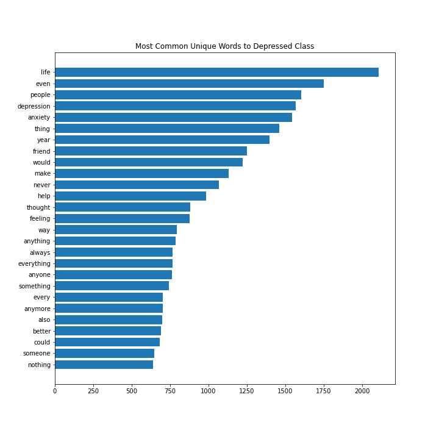
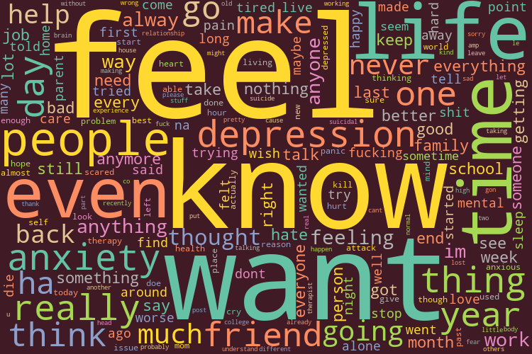
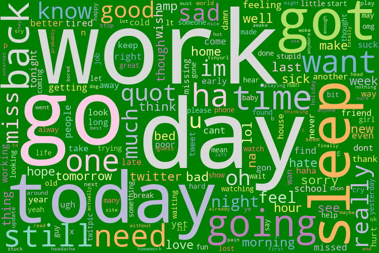
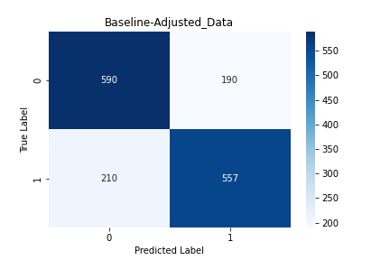
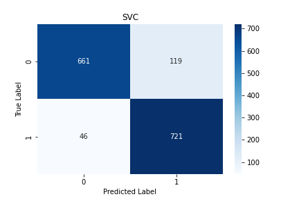
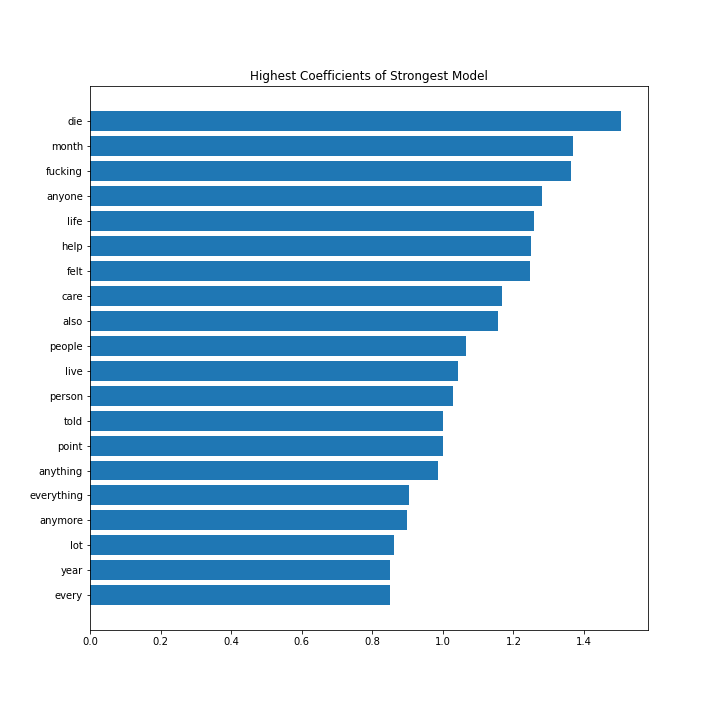
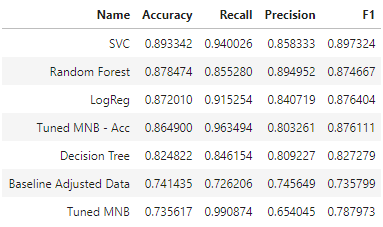
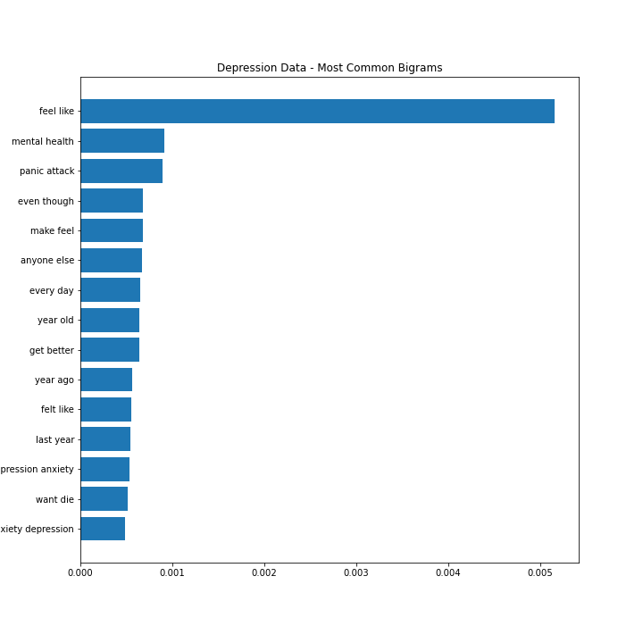
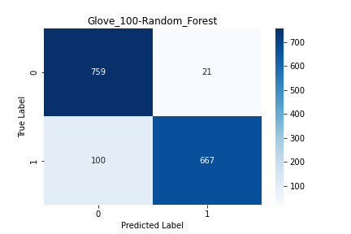

# Predicting Depression in Reddit Posts with NLP

#### Author: Spencer Hadel
***
Mental health is a field that could benefit greatly from the application of data science. Using a dataset of 7 thousand Reddit posts labeled as indicating whether or not the poster is diagnosed with depression, the model very accurately predicts whether a given post indicates potential diagnosis of the poster. This successfully demonstrates the need for more in-depth data collection and research into how analysis of written language can help identify mental disorders, and provide help to those in need.

***
## The Problem
In an age of increased awareness of mental health, it is becoming increasingly common for people to go _undiagnosed_ or _misdiagnosed_ with mental illness in ways that can be harmful or distressing to their own well-being or the well-being of those around them. There are many barriers in the way of any person getting the care they need, such as the _poor health insurance coverage_, the _lack of a support network_, or the _lack of understanding of what indicates a need for mental health treatment_. The use of modern tools in Data Science and Machine Learning could greatly aid in providing people the support and information they need.

__Reddit__ hopes to contribute to this cause by exploring the feasibility of creating a system that can identify potential indicators of mental disorders in order to provide users the outreach they need. Before this system can be implemented, however, there needs to be a _reasonable expectation_ that a system like this could reliably predict diagnoses with high accuracy, and without misdiagnosing users as showing signs of an illness that they do not, or even words, misdiagnosing a user as mentally healthy when they may be in serious need of care.

Using an existing dataset of users who are identified as either being __diagnosed or undiagnosed with depression__, we can create models that attempt to identify whether the contents of a post indicate the likelihood of a user showing signs of depression.

With a successful analysis of existing data, __Reddit can move forward with investing the time and resources__ needed to apply similar models on a large scale. With a dataset full of tens of thousands of posts, and verifiable evidence that the posts are written by individuals diagnosed with various mental conditions, Reddit could be a __pioneer in the field of Mental Health__, and help countless people in need.

***
## Data
There is a shockingly small amount of data available seeking to investigate the potential for this type of investigation. The [data for this project is from this source on kaggle](https://www.kaggle.com/datasets/infamouscoder/depression-reddit-cleaned/code), and is sates that its "raw data is collected through web scrapping Subreddits and is cleaned using multiple NLP techniques."

The data is composed of __7,731 posts from Reddit Users__, with the columns 'clean_text' and 'is_depression'. The 'clean_text' column contains posts from the users, and has already been cleaned to remove most punctuation from the posts, and is also already free of Null Values. The 'is_depression' label column is __split between two classes, 0 and 1, indicating whether a user is depressed (1), or _not_ depressed (0)__. This class is split almost evenly down the middle, with __3,831 entires being labeled as 'is_depressed = 1', and 3,900 entries being listed as 'is_depressed = 0__.

The primary complications with this data are that it _was not collected through official means, and there is no way to verify the real life mental diagnoses of the posters_. Part of the reason why this investigation is so important is to __prove how important it is for Reddit to invest the resources into collecting a much stronger dataset__. This analysis will show exactly how significant of an impact this could have.

The final thing to note about this data is that there are plenty of entries in which users are _specifically posting about their depression_, which of course is a dead giveaway as to the diagnosis of the poster. For the purposes of the analysis, certain words also had to be removed from the data in order to test the model's ability to predict outcomes without dead giveaways. The words that had to be removed were __depression, anxiety,__ and __feel__.

***
## Methods
This analysis begins by exploring the existing dataset, and using Python's __Natural Language Toolkit (NLTK))__ to create new columns with new variants of the data. This primarily includes __tokenizing, removing stopwords, and lemmatizing the data__, but also includes __removing the potentially problematic words__ mentioned above.

Utilizing a variety of Machine Learning Models (__MultiNomialNB, LogisticRegression, DecisionTree, RandomForest, and LinearSVC__), we compare which model scores highest on predicting what 'is_depression' label a given post has. The primary metrics focused on are:

 >Accuracy: Accuracy is of course, important. It indicates how successfully our model _predicts correct values_ of the two classes (is_depression = 1 and is_depression = 0, in this case).
 >
 >Recall: Recall is a models ability to _avoid predicting False Negatives_, or in this case, to _avoid misidentifying a class as depression=0_ when it in fact is labeled as is_depression=1.

The reason we want to __raise Accuracy while also keeping Recall high__ is that we want our models to be _accurate without accidentally misdiagnosing an individual as well when they in fact could benefit from a diagnosis of depression_.

The highest scoring model proves that __further data collection and results has a huge potential for greater success__, and by looking at the strongest coefficients of the model we can see examples of what types of language the model looks for in a given post to identify depression. 

Additionally, the analysis briefly explores __Word Embeddings, with Word2Vec models__ that identify not only individual words' prominence in a post but also factors in a word's semantic relationship to all other words in the corpus. This yields equally promising results, specifically using __GloVe (Global Vectors for Word Representation)__ from the Stanforf NLP Group

***
## Results
### EDA
Initial analysis of the corpus provides some interesting takeaways as to the prevalence of specific words throughout, particularly in the half of the data labeled as 'is_depressed=1':

Below are some word clouds showing prominent words from each dataset as well:

__'is_depression = 1':__

__'is_depression = 0':__

### Modeling
The baseline model, the _Multinomial Naive Bayes Model_ (when trained on the adjusted, preprocessed data with problematic words removed), produced a __74% Accuracy Score with a 72% Recall score__, which is better than the 50% score that random guessing would produce, but leaves room for improvement. The confusion matrix for this model is below:

The strongest model trained on this data was the _Linear Support Vector Classifier_, which produced a __89% Accuracy Score with a 94% Recall score__, whose confusion matrix can be seen here:

This model performed extremely well considering the limited dataset, and proves that there is absolute cause to collect a new, larger dataset to create a system for identification of mental disorder characteristics through reddit posts. The strongest coefficients within this model can be seen in this visualization

All model scores can be seen in this dataframe:

The analysis also touches on and identifies the __most prominent bigrams__ in the corpus, or in other words, what pairings of words appear more frequently in each class. Below is a visualization of common bigrams in the 'is_depression=1' class:

Finally, the analysis also creates a high scoring __Word2Vec Model using GloVe__ with a __90% Accuracy score and 85% Recall score__:

***
## Conclusion

In conclusion, it is clear from the scores of these models that with a larger and more varied dataset, __incredible strides could be made__ in the identification of mental illness. Therefore, Reddit should _undoubtedly move forward with collecting a significantly larger dataset for future testing.

### Notes on This Dataset
It is important to reiterate that this data was not collected by any official study, nor are the contents of it verifiably true. If the resulting dataset is at the very least one that is _more reliable than the one in this analysis_, with some verification of how reliable the claims of diagnosis are, there could be plenty more to learn even without a much larger dataset than this one. Likewise, a dataset consisting of "regular" posts, not specifically referring to the known existence of having a mental disorder, would also benefit future research drastically.

### Real World Application
With a large, varied, and verifiable dataset, Reddit could create model which __could identify a whole host of indicators of mental disorders__ with modern technology. This could revolutionize peoples' access to mental health, and be applied to so much more than a person's reddit posts. In the future, teachers could use a similar technology with students written assignments, or employers could use these results to make sure that their employees are being appropriately taken care of. To push the concept to another extreme, written posts could be used to identify the mentally ill who may pose a threat to others, so that they can receive help before lives are damaged or lost (which happens far too often in our current world).

#### Ethical Implications
Of course, it is also extremely risky to claim that a computer model should be the go-to source of information on a person's potential mental diagnosis. Additionally, such a tool __should ideally not be used as a toy or publicity tactic__, as this could lead to __excessive misdiagnosis and stigmatization__. With care, though, it is possible to create something that can genuinely help people.

It is important that the final product is delicate with the way it delivers results, and gives a user information on _mental health professionals_ and _supportive communities_, while also _reducing the stigma of mental illness_ and _preventing misdiagnosis and underdiagnosis_.

### Next Steps

The obvious next step is to begin the large data collection process on a more trustworthy and informative dataset. In the meantime, there can always be more explorations into new models and parameters with the current dataset, as well as __experimentation with the inclusion and exclusion of particular features to gain insightful new understandings__. 

####
As stated earlier, there are extremely limited resources to continue this research. However, there is [another, similar dataset with users online posts and their self-reported Meyers-Briggs Personality Type (MBTI)](https://www.kaggle.com/datasets/datasnaek/mbti-type). It is __extremely important__ to note that there is __increasingly high evidence that these personality types are not reliable indicators of a personality type__, and there is __very little data__ to back up the assertions of an MBTI test. 

That being said, while more accurate, reliable, and in-depth data is in the process of being collected, I plan to conduct a follow up analysis on how the methods used in this analysis may apply rto the MBTI test, and __more importantly__, to identify if there is any overlap between the results gleaned from the depression data and MBTI data that may help further inform the results discovered here.
***
***
